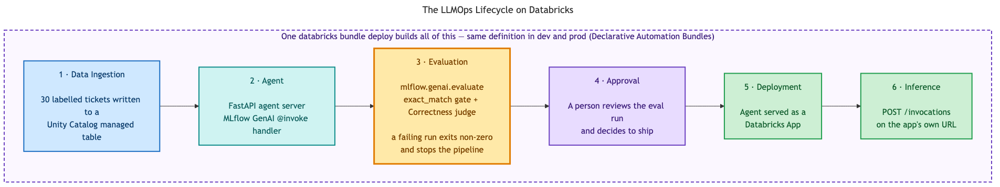
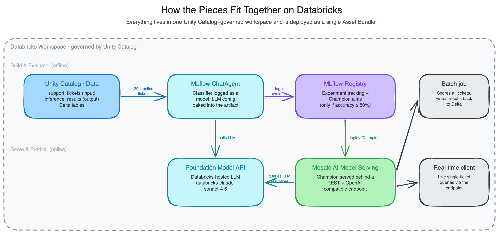
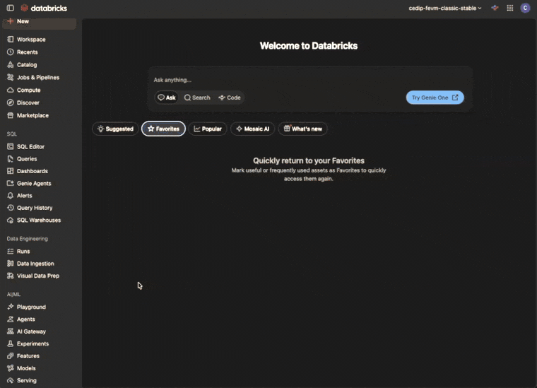
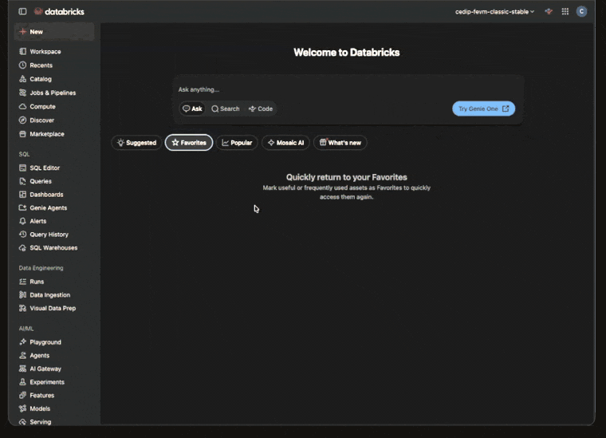

# LLMOps Quickstart for Databricks

A minimal but complete LLMOps example on Databricks. It carries one small LLM
application through its whole lifecycle:

**Data ingestion → agent build → evaluation → approval → deployment → inference**

The application is a customer support ticket classifier. Given the free text of a
ticket, it returns one of five categories: `billing`, `technical_issue`,
`feature_request`, `account_management`, or `other`. The agent runs as a
**Databricks App** and calls its LLM through a **Unity AI Gateway (UAIG) model
service**.

It uses the 2026 building blocks for LLMOps on Databricks:

- **Agent served as a Databricks App** — a FastAPI agent server (MLflow GenAI
  `@invoke` handler), not a Model Serving endpoint.
- **UAIG model services** — the agent calls a governed model service by its
  fully-qualified name, so access control, rate limits, and payload logging live
  in Unity Catalog rather than in the app.
- **MLflow 3 GenAI evaluation** — `mlflow.genai.evaluate` with scorers and tracing
  gates promotion.



## How the pieces fit together



Both diagrams are generated from the Mermaid sources next to them
(`docs/img/*.mmd`). To regenerate after a change:

```bash
npx @mermaid-js/mermaid-cli -i docs/img/llmops-lifecycle.mmd \
  -o docs/img/llmops-lifecycle.png -w 2600 -b white
```

## What you should know first

This quickstart assumes you are comfortable with:

- Python and the command line
- Unity Catalog basics (catalogs, schemas, tables, grants)
- Running the Databricks CLI against a workspace
- The general idea of an LLM prompt and response

You do not need prior MLflow, agent, or Declarative Automation Bundles experience —
each is introduced as you reach it. For a deeper grounding first, see the Databricks
Academy courses [DevOps Essentials for Data Engineering](https://customer-academy.databricks.com/learn/course/external/view/classroom/3640/devops-essentials-for-data-engineering)
(CI/CD and bundles) and [Building Agentic Applications on Databricks](https://customer-academy.databricks.com/learn/courses/5856/building-agentic-applications-on-databricks)
(agents, MLflow tracing, and evaluation). Academy pages require a free sign-in.

## Prerequisites

- The [Databricks CLI](https://docs.databricks.com/dev-tools/cli/install.html) and
  [`uv`](https://docs.astral.sh/uv/getting-started/installation/)
- A Databricks workspace with:
  - Unity Catalog enabled
  - Foundation Model APIs and UAIG model services enabled
  - Databricks Apps enabled
  - Unity Catalog privileges for the identity the jobs and app run as (the serverless
    runtime identity needs the relevant catalog/schema grants; being a workspace admin
    in the UI isn't always enough)
- A UAIG model service for the LLM. During the model services beta you create it once
  in the AI Gateway UI (code creation isn't available yet), then reference it by its
  fully-qualified name, for example `qs_catalog.default.claude-sonnet-5`.



## Configuration

Settings are bundle variables with sensible defaults:

| Variable | Default | Description |
|---|---|---|
| `catalog_name` | `main` | Unity Catalog catalog (must already exist) |
| `schema_name` | `llmops_quickstart` | UC schema (created by the bundle) |
| `llm_model` | `main.default.claude-sonnet-5` | Fully-qualified name of the UAIG model service the agent calls |
| `prod_service_principal` | `CHANGE_ME` | Identity the `prod` target deploys as. Pins the prod bundle root to one fixed location instead of the deployer's home folder. Set it for `--target prod`; `dev` ignores it. |

`main` is a common catalog name, so you may already have one. To keep the quickstart
self-contained and aligned with the companion
[MLOps Quickstart](https://github.com/databricks-solutions/mlops-quickstart), you can
point it at a dedicated catalog, e.g. `qs_catalog.llmops_quickstart`.

Override at deploy time:

```bash
databricks bundle deploy \
  --var="catalog_name=qs_catalog" \
  --var="llm_model=qs_catalog.default.gpt-oss-120b"
```

## Run it

### 1. Deploy the bundle

```bash
databricks bundle deploy \
  --var="catalog_name=qs_catalog" \
  --var="llm_model=qs_catalog.default.claude-sonnet-5"
```

A bundle ([Declarative Automation Bundles](https://docs.databricks.com/dev-tools/bundles/index.html),
or DABs) is a folder of YAML plus the notebooks and files its jobs and apps need.
`deploy` creates the schema, the MLflow experiment, the data-ingestion job, and the
app.

### 2. Ingest the data

```bash
databricks bundle run data_preprocessing_job --var="catalog_name=qs_catalog"
```

This writes 30 hand-labelled support tickets (six per category) to a Unity Catalog
managed table, `support_tickets`. It doubles as the evaluation set.

### 3. Evaluate the agent

```bash
uv sync
uv run agent-evaluate
```

`mlflow.genai.evaluate` runs the agent over the 30 tickets with two scorers: a
deterministic `exact_match` scorer (the promotion gate) and the out-of-the-box
`Correctness` LLM judge (shown for demonstration). Every prediction is captured as an
MLflow Trace. The command exits non-zero if exact-match accuracy is below the
threshold (default 80%), so it works as a CI gate.

Open the **Experiments** tab and click into a trace to see each prediction's inputs,
outputs, expectations, and scorer results:



Set `CATALOG_NAME` and `SCHEMA_NAME` (and `LLM_MODEL`) in your `.env` first — see
`.env.example`.

### 4. Approve and deploy the app

Evaluation is the gate; a person decides to ship. Once you have reviewed the eval run
and you are satisfied, deploy the app:

```bash
databricks apps deploy llmops-quickstart-classifier-dev \
  --source-code-path "$(databricks bundle summary -o json | \
    python3 -c 'import json,sys; print(json.load(sys.stdin)["workspace"]["file_path"])')"
```

The source path is wherever the bundle uploaded its files, which depends on the
target and the identity that deployed it — read it from `bundle summary` rather
than hardcoding it.

The app is a FastAPI agent server. It exposes the classifier at `/invocations` and
sends every request to the LLM through the model service, so the AI Gateway governs
and logs the traffic.

### 5. Inference

Send a ticket to the running app:

A Databricks App is a web server with its own hostname, so you call the app's URL
directly — there is no `/api/2.0/apps/.../invocations` control-plane endpoint. Look
the URL up with the SDK, then POST to its `/invocations` route:

```python
import requests
from databricks.sdk import WorkspaceClient

w = WorkspaceClient()
app = w.apps.get("llmops-quickstart-classifier-dev")

resp = requests.post(
    f"{app.url}/invocations",
    headers={"Authorization": f"Bearer {w.config.oauth_token().access_token}"},
    json={"ticket": "I was billed twice for my annual plan."},
    timeout=60,
)
print(resp.json()["category"])   # billing
```

For batch scoring, read `support_tickets` and call the app for each row.

## Local development

Run the agent server on your machine before deploying:

```bash
cp .env.example .env    # then fill in profile, experiment id, and LLM_MODEL
uv run start-server     # serves on http://localhost:8000
```

Test it:

```bash
curl -X POST http://localhost:8000/invocations \
  -H "Content-Type: application/json" \
  -d '{"ticket": "The mobile app crashes on iOS 17"}'
# {"category": "technical_issue"}
```

## Project structure

```
agent_server/
  agent.py              # @invoke ticket classifier; calls the model service
  evaluate_agent.py     # mlflow.genai.evaluate with the exact_match gate
  start_server.py       # FastAPI agent server entry point
notebooks/
  1_data_preprocessing/
    data_ingestion.py   # writes the support_tickets UC managed table
resources/
  1_data_preprocessing_job.yml
app.yaml                # app runtime config (command + env)
databricks.yml          # bundle: app resource, experiment, variables, targets
pyproject.toml          # dependencies (managed with uv)
```

## Before you call it done

- [ ] `databricks bundle validate` passes
- [ ] The ingestion job wrote `support_tickets`
- [ ] `uv run agent-evaluate` passes the threshold, with traces in the experiment
- [ ] The app is deployed and `/invocations` returns a category
- [ ] The model service shows the agent's traffic (governance and logging)
- [ ] The `prod` target deploys into its own schema

## Notes

- The `llm_model` value is the only thing you change to switch models — point it at
  a different model service (e.g. `qs_catalog.default.gpt-oss-120b`).
